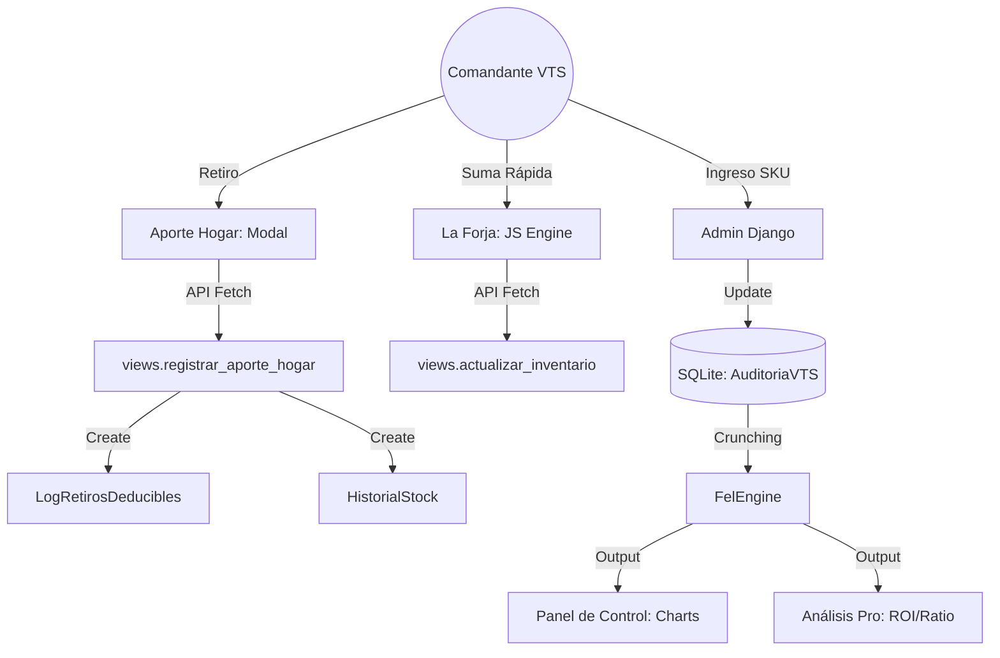
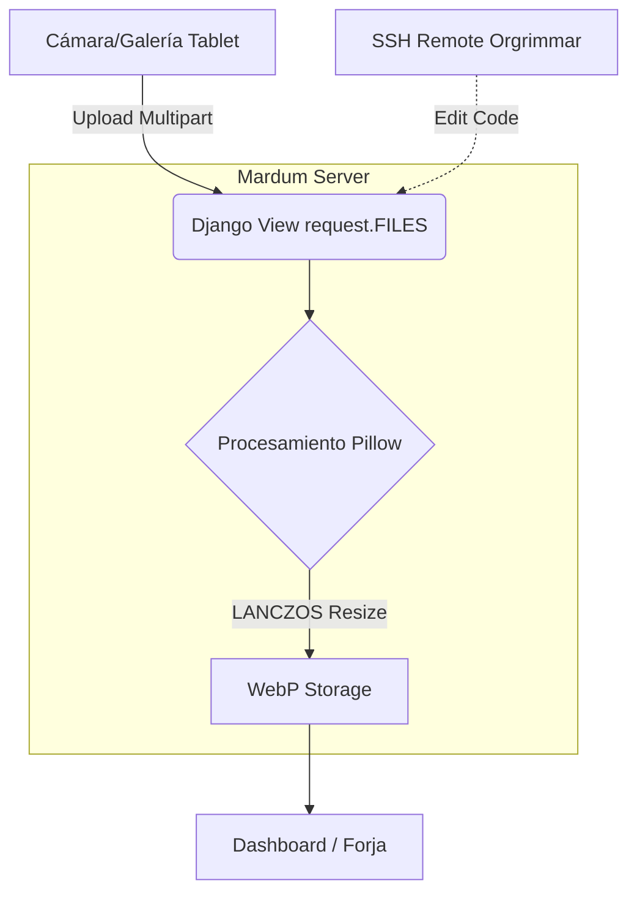
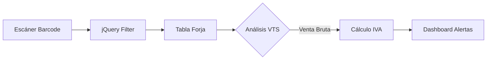

# 📜 Registro de Cambios (Changelog)
# 🛠️ Martillo Vil - Versión 2.6 (Dj6) Estado: Estable 🟢

### 📋 Cambios Principales
- **Chasis UI**: Implementación de Sidebar expandible inteligente y diseño minimalista v2.6.
- **Motor de Estabilidad**: Migración a Django 6 (Beta 1) con optimización de consultas `annotate` en SQLite.
- **La Forja Pro**: 
  - Buscador optimizado para scanners (evento `input`).
  - Termómetro visual de stock sin ruido de texto.
  - Sistema de "Suma Rápida" para ingreso de mercadería PM.
- **API Aporte Hogar**: Endpoint dedicado para retiros manuales con trazabilidad doble (Deducibles + Historial General).

### 📊 Métricas Actuales Monitoreadas (Cierre Refactorización)
- **Capital Real Auditado**
- **Ratio (ROI Proyectado)**
- **SKU Activos Totales**
- **Estado de Auditoría**

### 🚀 Despliegue
- **Rama**: `v2.6-modulo6-dj6`
- **Ambiente**: Local / Desplegando a produccion un viernes...

### 🧜‍♂️ Mapa Visual del Sistema (Actualizado)

_________________________________________________________________________________________
# 📜 Registro de Cambios (Changelog)
Estado: Estable 🟢 | Rama: v2.5

## 📸 Módulo 5: Identidad Visual y Remota (NUEVO)
+ Motor de Imágenes WebP: Integración de Pillow con algoritmo LANCZOS en el modelo para conversión automática de JPG/PNG a WebP (800px max).

+ Infraestructura Mardum: Migración exitosa a servidor remoto de pruebas con acceso Remote SSH y gestión de permisos de media/.

+ Sidebar Inteligente: Implementación de Sidebar comprimido definitivo con efecto hover para optimizar espacio en tablet.

+ Radar de Quiebres: Nuevo widget en Dashboard que desglosa automáticamente productos con stock cero, estilizando la estética de "La Forja".

+ Limpieza de Interfaz: Eliminación de columnas innecesarias en la Forja para favorecer la lectura de SKU y Barcode.

## 📈 Motor de Inteligencia Financiera
+ Lógica de IVA: Implementación del "Tercer Operador" en la propiedad margen_valor. Ahora descuenta el 19% automáticamente para mostrar rentabilidad neta real.

+ Gauges de Estado: Sincronización de colores y estados (PÉRDIDA, ILLIDARI) basados en márgenes netos sinceros.

## 🎨 Interfaz de Usuario (UI/UX)
+ Buscador jQuery Ninja: Filtro instantáneo en tiempo real por SKU, Producto o Barcode.

+ Dashboard Maestro: Reestructuración de tarjetas; Capital Total ahora domina el ancho completo (100%) para jerarquía visual.

## 🧜‍♂️ Mapa Visual del Sistema (Actualizado)

__________________________________________________________________________________________
# 📜 Registro de Cambios (Changelog) 
Estado: Estable 🟢 | Rama: v2.3-hybrid-bridge

## 🔧 Infraestructura y Base de Datos
+ Reinicio de Forja: Se eliminó la base de datos db.sqlite3 y las migraciones antiguas para corregir errores de tipo (IntegrityError).

+ Modelo AuditoriaVTS: Se añadió soporte para variante (Tallas/Colores) y codigo_barras (Barcode).

+ Clave Primaria: El sku se estableció como PK, eliminando la dependencia del id automático de Django.

## 📈 Motor de Inteligencia Financiera
+ Lógica de IVA: Implementación del "Tercer Operador" en la propiedad margen_valor. Ahora descuenta el 19% automáticamente para mostrar rentabilidad neta real.

+ Gauges de Estado: Sincronización de colores y estados (PÉRDIDA, SOBREVIVENCIA, ILLIDARI) basados en márgenes netos sinceros.

## 🎨 Interfaz de Usuario (UI/UX)
+ Buscador jQuery Ninja: Filtro instantáneo en tiempo real por SKU, Producto o Barcode sin recargar la página.

+ Corrección de Modales: Ajuste de etiquetas HTML (data-bs-toggle) para que el Modal Maestro flote correctamente en el centro.

+ Glosas Transparentes: Los campos ahora indican explícitamente COSTO NETO y VENTA BRUTO para evitar errores de ingreso.

+ Alertas Dashboard: Sustitución del panel de "Progreso" por un contador de Margen Crítico (Pérdidas) y Quiebres.

# 🧜‍♂️ Mapa Visual del Sistema

