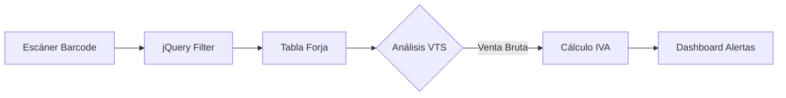

# 📜 Registro de Cambios (Changelog) 
Estado: Estable 🟢 | Rama: v2.3-hybrid-bridge

## 🔧 Infraestructura y Base de Datos
+ Reinicio de Forja: Se eliminó la base de datos db.sqlite3 y las migraciones antiguas para corregir errores de tipo (IntegrityError).

+ Modelo AuditoriaVTS: Se añadió soporte para variante (Tallas/Colores) y codigo_barras (Barcode).

+ Clave Primaria: El sku se estableció como PK, eliminando la dependencia del id automático de Django.

## 📈 Motor de Inteligencia Financiera
+ Lógica de IVA: Implementación del "Tercer Operador" en la propiedad margen_valor. Ahora descuenta el 19% automáticamente para mostrar rentabilidad neta real.

+ Gauges de Estado: Sincronización de colores y estados (PÉRDIDA, SOBREVIVENCIA, ILLIDARI) basados en márgenes netos sinceros.

## 🎨 Interfaz de Usuario (UI/UX)
+ Buscador jQuery Ninja: Filtro instantáneo en tiempo real por SKU, Producto o Barcode sin recargar la página.

+ Corrección de Modales: Ajuste de etiquetas HTML (data-bs-toggle) para que el Modal Maestro flote correctamente en el centro.

+ Glosas Transparentes: Los campos ahora indican explícitamente COSTO NETO y VENTA BRUTO para evitar errores de ingreso.

+ Alertas Dashboard: Sustitución del panel de "Progreso" por un contador de Margen Crítico (Pérdidas) y Quiebres.

# 🧜‍♂️ Mapa Visual del Sistema

```mermaid
graph LR
    A[Escáner Barcode] --> B[jQuery Filter]
    B --> C[Tabla Forja]
    C --> D{Análisis VTS}
    D -->|Venta Bruta| E[Cálculo IVA]
    E --> F[Dashboard Alertas]
```