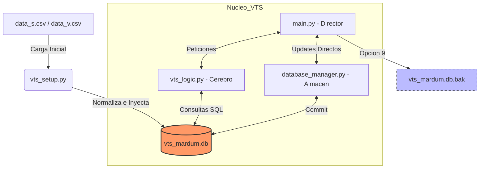

# VTS - Vacadari Terminal System v1.8.1 🐮
Sistema de gestión de inventario táctico basado en terminal para control de stock, valorización y toma de decisiones ejecutivas. Ahora potenciado por motor SQL.

## 🚀 Inicio Rápido 2026
1. Requisitos: Tener `pandas` instalado: `pip install pandas`.

2. Preparación: Mantener los archivos `data_s.csv` y `data_v.csv` en la raíz (solo para el primer despliegue).

3. Inicialización: Ejecutar `python3 vts_setup.py` para construir el núcleo SQL.

4. Ejecución: Lanzar con `python3 main.py`.

## 🏗️ Arquitectura del Sistema: SQL Engine
El sistema ha evolucionado de una gestión basada en archivos planos a una arquitectura relacional sólida:

- **Almacén Central (vts_mardum.db)**: Base de datos SQLite que centraliza el Maestro y el Inventario.

- **Consultas Relacionales**: Uso de JOINs para cruzar precios y stock en tiempo real sin latencia de disco.

- **Persistencia Robusta**: Registro instantáneo de movimientos; cada "Aporte Hogar" se graba directamente en la DB.

- **Sistema de Respaldo**: Creación automática de vts_mardum.db.bak en cada cierre seguro (Opción 9).

## 🖥️ Interfaz y Experiencia
- **Splash Screen**: Arte ASCII (66px) con carga perezosa de librerías.

- **Alertas Dinámicas**: El menú principal consulta la DB en milisegundos para indicar stock crítico mediante el tag `[⚠️ REVISAR!]`.

- **Status Local**: Indicador `STATUS: ONLINE (LOCAL SQL)` para confirmar conexión con el motor.

## 🛡️ Seguridad y Privacidad
Este repositorio utiliza un archivo `.gitignore` estricto. **NUNCA** se subirán archivos `.csv`, `.db`, `.xlsx`, `*.bak` o `.log` ya que contienen el modelo de negocios y costos confidenciales de Inversiones Vacadari SpA. El resto, puedes ajustarlo segun tus requerimientos.

## Flujo de datos
El sistema opera bajo un ciclo de **Consulta-Procesamiento-Persistencia**, separando la lógica de negocio de la gestión de datos:

## 🛠️ Roadmap 2026
[x] Migración total de arquitectura CSV a SQLite.

[x] Sistema de inicialización y normalización de columnas (vts_setup.py).

[x] Respaldo automático de base de datos binaria.

[ ] Conexión GSheet API: Sincronización de entrada de datos remota y reformulación de planillas.

[ ] Módulo de Gráficos: Integración con Matplotlib para visualización de capital y rotación de stock.

[ ] Cloud Sync: Subida automática del respaldo .db.bak a la nube.