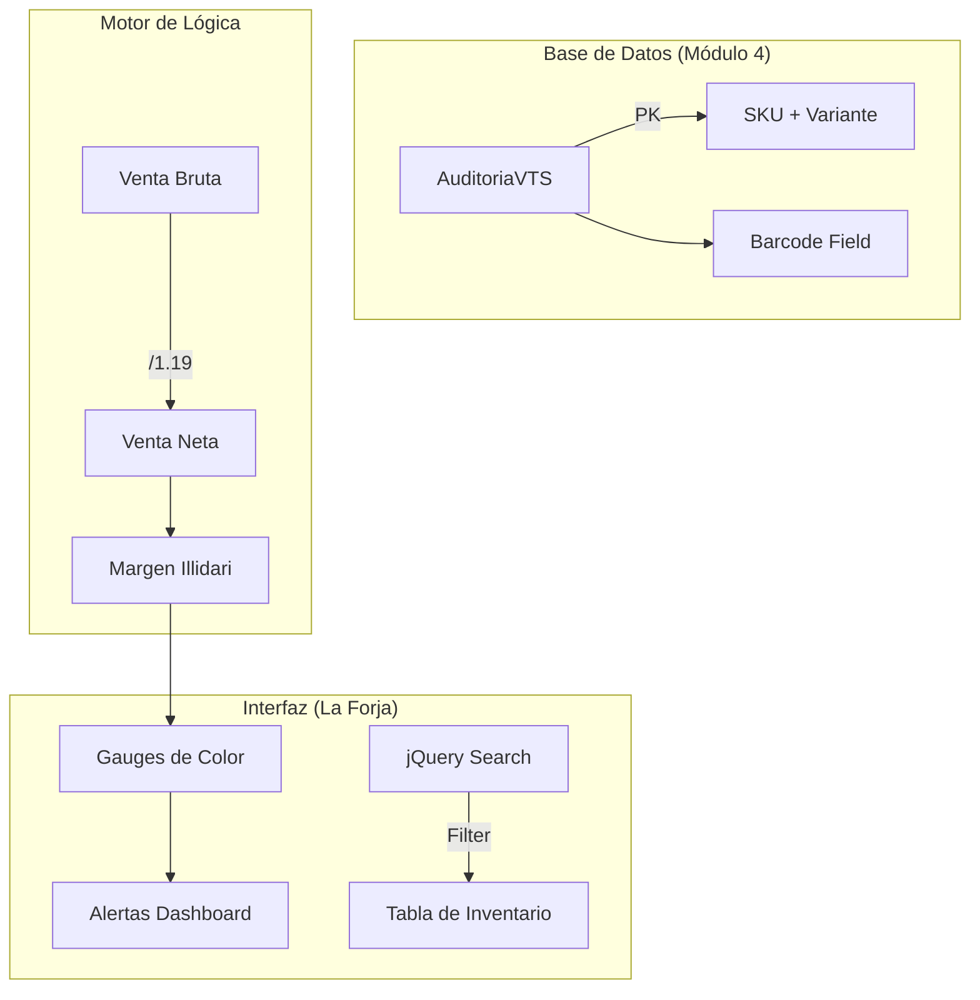

# VTS - Vacadari Terminal System v2.5.0 (Edición Martillo Vil) 🐮🔨
Sistema de gestión de inventario táctico. Evolucionado de un orquestador CLI a una Arquitectura de Contenedores con Dashboard Web Interactivo.

## 🚀 Despliegue Docker (Enero 2026)
Infraestructura: docker-compose up -d (Levanta el entorno Django + DB).

Succión de Datos: docker exec -it vts_martillo_vil python PORTAL/manage.py importar_csv (Procesamiento blindado de reportes VTS).

Acceso Web: http://localhost:9000

## 🏗️ Arquitectura Evolucionada: Portal Web Django
El sistema ahora opera como un servicio persistente dentro de Docker:

vts_martillo_vil (Container): Entorno aislado en Python 3.12.

dashboard/ (App Django): Cerebro del sistema. Gestiona la lógica de auditoría y visualización.

importar_csv.py (Rimuru): Comando de gestión que neutraliza "Minas N2" (valores nulos y filas corruptas).

Chart.js: Motor de renderizado para analítica de capital en tiempo real.

## 📊 Ciclo de Vida del Inventario (Alimentación Dual)
El sistema integra la carga masiva por script y el ajuste quirúrgico vía web:

## 🛡️ Protocolo de Resguardo y Regularización
Costo Inteligente: Si un producto llega sin precio en el CSV, el sistema recupera el último costo histórico para no falsear el Valor Neto.

## 🛠️ Roadmap (Actualizado 11-01-2026)
[x] Migración a Docker y Arquitectura Web Django.

[x] Implementación de Dashboard con Chart.js (Visualización de Capital Neto).

[x] Script de succión blindada contra fallos de datos (Minas N2).

[x] Formulario de Ajuste Manual en la GUI (Ficha de Producto funcional).

[x] Motor de Búsqueda Dual (JS Instantáneo + Django Pro).

[ ] PRÓXIMO: Filtros dinámicos por Sección en el Dashboard (Usando la lógica de categorías Skydash).

[ ] PRÓXIMO: Logs de Sistema (Historial de quién ajustó qué SKU y cuándo).