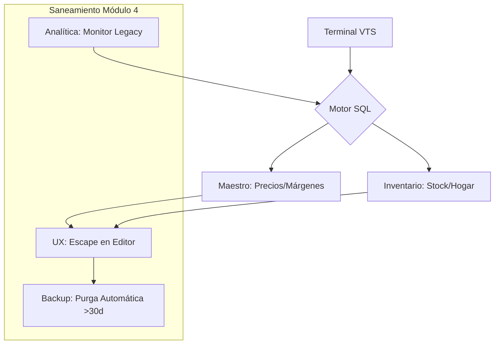

# VTS - Vacadari Terminal System v2.1.0 🐮
Sistema de gestión de inventario táctico basado en terminal para control de stock, valorización y toma de decisiones ejecutivas. Ahora operando bajo arquitectura SQL Modular.

## 🚀 Inicio Rápido 2026
1. **Requisitos**: `pip install pandas matplotlib sqlite3`
2. **Despliegue Inicial**: Ejecutar `python3 vts_setup.py` (Solo una vez para migrar desde CSV).
3. **Ejecución**: Lanzar con `python3 vts_main.py`.
4. **Respaldo**: El sistema genera `vts_mardum.db.bak` automáticamente al salir (Opción 0).

## 🏗️ Arquitectura del Sistema: SQL Modular
VTS ha dejado de ser un script lineal para convertirse en un ecosistema de módulos especializados:

* **`vts_main.py`**: Interfaz de usuario y orquestador central (Illidan 66px Engine).
* **`vts_logic.py`**: Motor de reglas de negocio, cálculos de márgenes y gestión de stock.
* **`vts_graphics.py`**: Dashboard visual de capital mediante Matplotlib.
* **`database_manager.py`**: Capa de persistencia y gestión de conexión SQLite.
* **`vts_utils.py`**: Kit de herramientas estéticas y validación de entrada.

## 🖥️ Interfaz v2.1 (Panel de Control)
La nueva disposición separa el flujo operativo de la inteligencia de negocio:
- **Flujo 1-4**: Operaciones de Bodega (Ingresos, Egresos, Búsquedas y Combos).
- **Flujo 5-8**: Inteligencia de Mercado (Estrategias, Reposición, Administración y Analytics).

## 🛡️ Seguridad y Resguardo
- **Zero-Data Policy**: El `.gitignore` protege el modelo de negocios (confidencial).
- **Integridad SQL**: Validación automática de SKUs en el arranque del sistema.
- **Backup Unificado**: Respaldo local mediante `shutil.copy2` para asegurar la integridad binaria de la DB.

## 📊 Flujo de Datos 2.1
El sistema ahora integra la entrada manual y la analítica visual como pilares del ciclo de vida del inventario:

## 🛠️ Roadmap Actualizado (Enero 2026)
[x] Migración total a arquitectura SQLite (Motor Relacional).

[x] Consolidación de módulos Administrativos (Bridge/Editor/Bautismo).

[x] Módulo de Gráficos: Visualización de capital por secciones mediante Matplotlib.

[x] Sistema de Respaldo Local unificado.

[ ] PRÓXIMO: Automatización de Catálogo de Ofertas (Marketing Generator).

[ ] PRÓXIMO: Cloud Sync - Sincronización automática de respaldos a la nube.